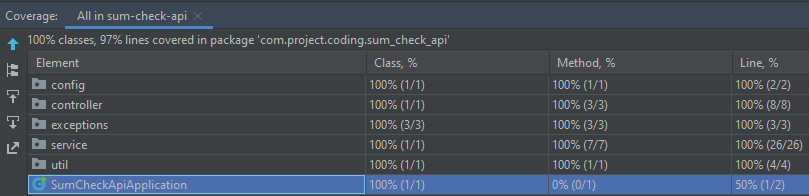
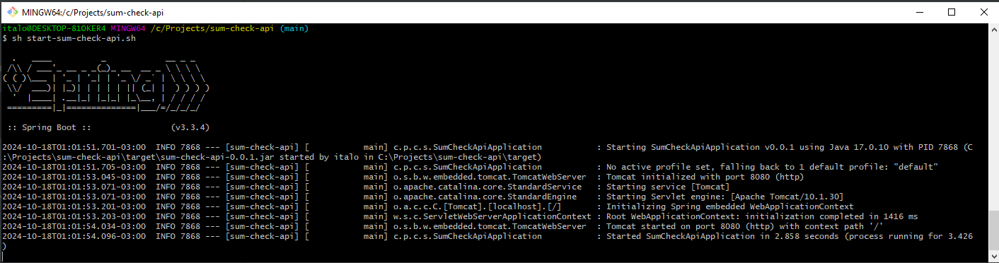
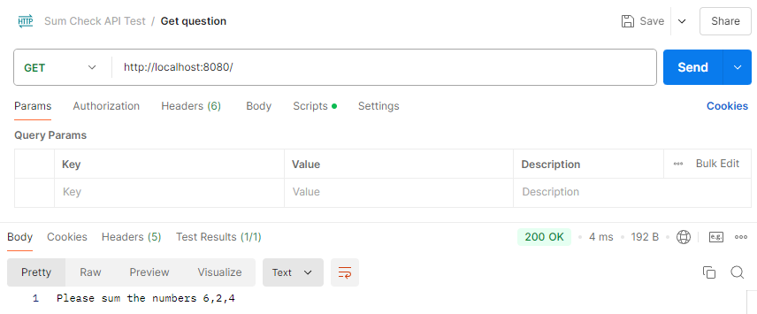
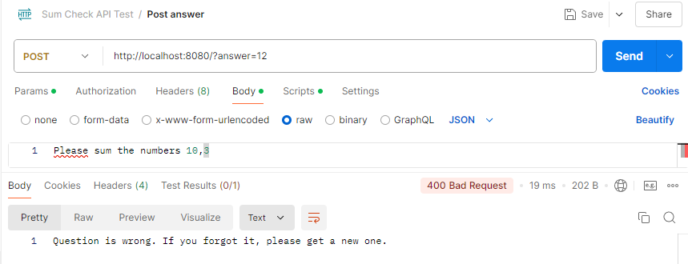
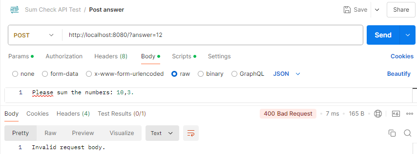
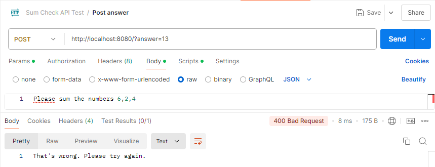
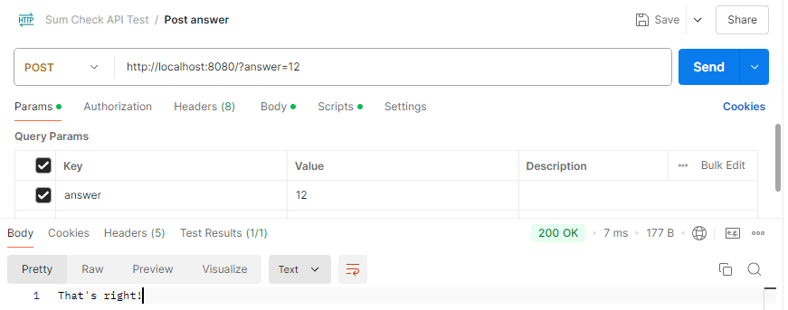

# sum-check-api
    Maven project
    Java version: 17
    Spring Boot: 3.3.4

        - Use the shell script "start-sum-check-api.sh" to run the application
        - Edit the port to be used in "src/main/resources/application.properties"

###Coding Exercise:
######Objective:
To make sure our application is accessed by humans and not a by any computers or bot.

######Description:
We want to make sure that the users who are using our application knows how to add numbers. To achieve this, we want to provide the user/client with a question and then allow the user/client to submit an answer. If the user/client and the service were both real persons, then they would have interacted in the following manner:

    Client: Hey Service, can you provide me a question with numbers to add?
    Service: Here you go, solve the question: “Please sum the numbers 9,5,3”.
    Client: Great. The original question was “Please sum the numbers 9,5,3” and the answer is 15.
    Service: That’s wrong. Please try again.
    Client: Sorry, the original question was “Please sum the numbers 9,5,3” and the answer is 17.
    Service: That’s great
  

## Overview
Two services were developed with the same path "/", distinguished by the methods:

1) GET: Responsible for generating a question with N random numbers between 0 and 10. The client's IP is saved with the respective question numbers in a Map to safeguard against cheating. The limit of values and the possible sizes of N are configured using constant values. By default 2 <= N <= 3, following the samples in the description of the coding exercise.

2) POST: Responsible for receiving the earlier generated question in the body and the answer in the query parameter. To validate the answer, the question in the body is first verified with the Map, which should contain the key-value pair formed by the IP and the numbers of the question. If validated, the sum of the numbers is checked against the answer. In case of success, status 200 is returned; otherwise, status 400 is returned, along with the appropriate message for each scenario.

## Packages
- config: Contains AppConfig.java, which is used to annotate the Random class as a Bean in this Spring Boot application. Doing so allows this dependency to be injected into the Service layer in a loosely coupled manner, making it easier to mock in unit tests.

- controller: Contains QuestionController.java, the REST controller with the endpoints of both services, having the Service layer injected by the constructor.

- service: Contains the interface QuestionService.java with the public methods used in QuestionController.java, whose implementations are in QuestionServiceImpl.java. Using the interface pattern is a good practice to decouple the business logic from the rest of the application. The same approach could be used for the Repository layer if it existed here.

- exceptions: Contains the possible exceptions for the application, extending RuntimeException.java, with specific messages for each situation. This segregation helps manage different error scenarios in the application, allowing for more precise validation in unit tests.

- util: Contains the class Constants.java used to store hard-coded values, providing better readability in the code, especially in the Service layer and unit tests.

##Tests
- Unit Tests: Using Mockito, the logical units were tested across various scenarios. The pattern followed was from a successful scenario with default values initialized in variables. Changes were introduced one by one, allowing for easy identification of specific differences in each scenario.

- Integration Tests: Without Mockito, except for HttpServletRequest (since it cannot be concretely instantiated), the Controller layer was tested covering all units integrally.

##Improvements
- Using a database will enhance the resilience of the application, ensuring it is stateless really. The Map can be replaced by a table represented by an Entity with the client IP as the ID and the array of numbers as the second column. A new layer, Repository, would be included extending JpaRepository.

- Configure Docker to start the application and the database, making the system agnostic to operating systems, versions and dependencies.

- Time control, concerning the validity period of the question, ensuring it can be answered within a specified timeframe.

- Limit the quantity of generated questions in a period without receiving an answer from the client. This can help prevent spamming.

## Prints

